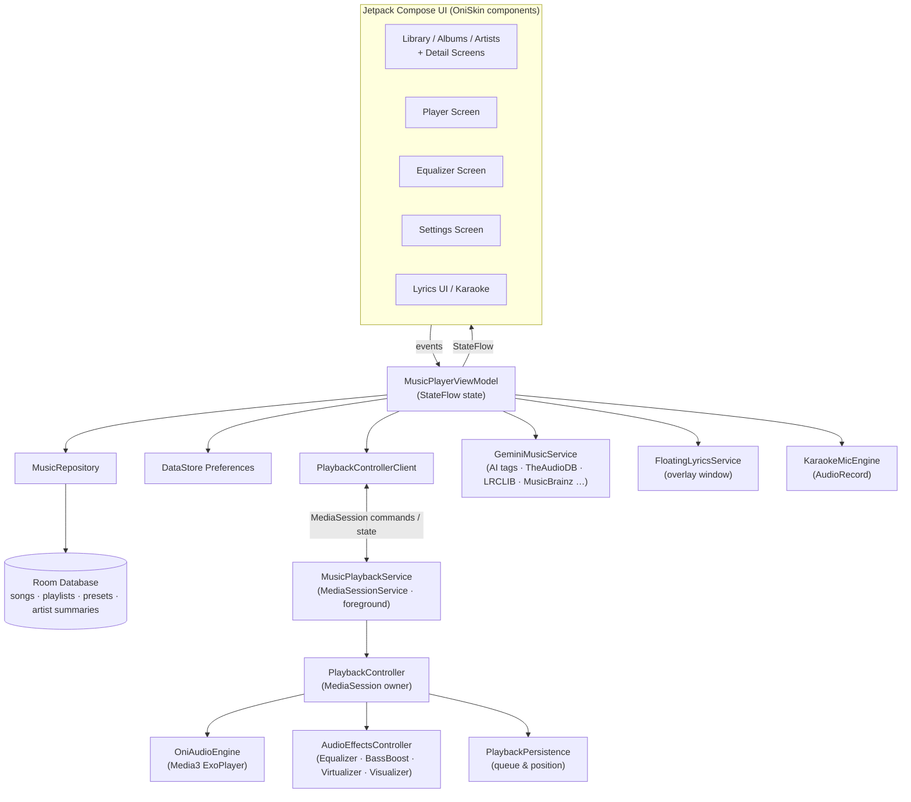

<div align="center">

# 🎵 OniPlayer

**A modern, offline-first music player for Android — with pro-grade audio FX, synced lyrics, karaoke mode, AI metadata tools, and a fully themable skin system.**

[-3DDC84?logo=android&logoColor=white)](#getting-started)
[](#tech-stack)
[](#tech-stack)
[](#architecture)
[](#license)

</div>

---

## About

OniPlayer is a local music player built entirely with **Kotlin** and **Jetpack Compose**. It plays the music that's already on your device — no accounts, no streaming, no ads — and layers a surprisingly deep feature set on top:

- A **5-band equalizer with bass boost, virtualizer, and a real-time visualizer** on top of a Media3/ExoPlayer playback core with a persistent queue.
- **Time-synced lyrics (LRC), a floating lyrics overlay, and a karaoke mode** with live microphone visualization.
- **AI-powered metadata cleanup** — fix missing or wrong tags across your whole library using Gemini, cross-checked against MusicBrainz, iTunes, Deezer, and AudD.
- A **skin-based design system** (`OniSkin`) with 7 built-in themes, Material You support, and granular customization (blur, glass, corner radius, accents).

The project follows an MVVM architecture with a strict unidirectional data flow, a token-driven skin engine, and a Media3 `MediaSessionService` playback core that integrates with the system (lock screen, Bluetooth headsets, Android Auto).

## Features

### 🎧 Playback
- **Media3 / ExoPlayer core** wrapped in a `MediaSessionService` — lock screen controls, notification media controls, headset buttons, and external session clients (Android Auto) all work out of the box.
- **Persistent queue**: the queue, current track, and playback position survive app restarts (`PlaybackPersistence`).
- **Queue management**: *Play Next*, *Add to Queue*, reordering, and auto-scroll to the current track.
- **Advanced shuffle modes**:
  - **Random** — pure random pick
  - **Discover** — weighted toward songs you rarely play
  - **Favorites Boost** — weighted toward your favorited songs
  - Shuffle orders are precomputed off the main thread for gapless feel.
- **Repeat modes**, seamless play/pause/seek, and a stable, race-condition-hardened playback controller (`PlaybackController` / `PlaybackControllerClient`).

### 🎚️ Audio FX
- **5-band equalizer** (60 Hz · 230 Hz · 910 Hz · 4 kHz · 14 kHz) attached to the live audio session.
- **BassBoost** and **Virtualizer** strength sliders (0–100 %).
- **Real-time visualizer** — FFT beat-energy sampling that drives reactive UI animations (permission-gated, degrades gracefully).
- **Presets**: built-in presets plus your own saved presets, stored in the local Room database and re-applied automatically per session.

### 📚 Library
- Fast **MediaStore-backed library scan** with metadata backfill caching.
- **Songs, Albums, Artists, Playlists** categories with list **and grid layouts**.
- Dedicated **Album** and **Artist detail screens** with artwork, song counts, and biographies.
- **Smart playlists** (Most Played, Recently Added, Recently Played, Favorites), favorites, star ratings, and a **quick stats strip** (songs / artists / albums / favorites).
- Full-text **search** across the library, scroll-state preservation, and reusable empty/error/loading states.

### 📝 Lyrics & Karaoke
- **Synced lyrics**: parses `.lrc` timestamps (multiple precision formats) and highlights lines as the song plays; plain-text lyrics are supported too.
- **Online lyrics search** across **LRCLIB**, **Lyrist**, and **Lyrics.ovh** — with automatic fetch, manual search, per-source selection, and a built-in editor.
- **Floating lyrics overlay**: a draggable, always-on-top lyrics card rendered by its own service (`SYSTEM_ALERT_WINDOW`), so lyrics follow you outside the app.
- **Karaoke mode**: live microphone capture with a real-time amplitude visualization and mic gain control — sing along with the visual feedback.

### 🤖 AI Metadata Tools (Gemini)
- **"Optimize Tags"**: sends the song's audio + current metadata to the **Gemini API** and proposes corrected title/artist/album/genre — verified against **MusicBrainz**, **iTunes Search**, **Deezer**, and **AudD audio fingerprinting** before applying.
- **AI-assisted file renaming** with explicit per-file consent and safe MediaStore cleanup.
- **Batch tag updates** and a full manual tag editor.
- **Artist biographies & photo galleries** fetched from **TheAudioDB** (with Wi-Fi/mobile-data awareness).
- The API key lives in a local `.env` file and is injected at build time — AI features degrade gracefully without it.

### 🎨 Skin System & Theming
OniPlayer's UI is built on **OniSkin**, a token-driven skin engine (see the [design system section](#skin--design-system)):

- **7 built-in themes**: Cosmic Obsidian · Cyberpunk Neon · Amber Gold · Forest Zen · Classic Dark · Aero Light · High Density.
- **Appearance modes**: Light, Dark, AMOLED, and Follow System.
- **Material You** dynamic color support (Android 12+).
- **Custom accent color** picker.
- **Glassmorphism controls**: toggle glass effects and tune **blur strength**, **corner radius**, and **background transparency**.
- **RTL-safe** UI via Material 3 AutoMirrored icons.

## Screenshots

> 🚧 Screenshots coming soon — drop captures of the screens below into a `/screenshots` folder and update this table.

| Library | Now Playing | Lyrics | Equalizer | Settings |
| :---: | :---: | :---: | :---: | :---: |
| *placeholder* | *placeholder* | *placeholder* | *placeholder* | *placeholder* |

## Architecture

MVVM with unidirectional data flow: Compose screens render state exposed as Kotlin `StateFlow` from `MusicPlayerViewModel`, and user events flow back down through the ViewModel to the repository and playback layers.



**Key playback design points** (implemented in `playback/`):

| Component | Responsibility |
| :--- | :--- |
| `MusicPlaybackService` | Thin `MediaSessionService` foreground service; owns the session lifetime |
| `PlaybackController` | In-service controller: owns the `MediaSession`, serializes commands, guards releases against race conditions |
| `PlaybackControllerClient` | UI-side client: sends commands, exposes a single unified `PlaybackState` flow to the ViewModel |
| `OniAudioEngine` | Media3 ExoPlayer wrapper: source loading, position updates, session attachment |
| `AudioEffectsController` | Equalizer / BassBoost / Virtualizer / Visualizer bound to the active audio session; emits FFT `beatEnergy` |
| `PlaybackPersistence` | Saves and restores queue, track, position, shuffle mode, and repeat mode |
| `ShuffleCalculator` | Weighted shuffle orders for Random / Discover / Favorites-Boost modes |
| `PlaybackDelayController` | Centralizes playback timing delays safely off the main thread |

## Tech Stack

| Layer | Technology |
| :--- | :--- |
| Language | Kotlin 2.2 · Coroutines + Flow |
| UI | Jetpack Compose · Material 3 · Material Icons Extended · Coil · Palette API |
| Playback | **Media3 ExoPlayer 1.10 + MediaSession** · `android.media.audiofx` (EQ, BassBoost, Virtualizer, Visualizer) |
| Data | Room 2.7 (KSP) · DataStore Preferences |
| Networking | OkHttp · Retrofit · Moshi |
| AI & Metadata | Gemini API (`generativelanguage`) · MusicBrainz · iTunes Search · Deezer · AudD · TheAudioDB · LRCLIB / Lyrist / Lyrics.ovh |
| Widgets | Glance (dependency reserved — no widgets in the current build) |
| Build | AGP 9.1 · Gradle version catalog · KSP · Secrets Gradle Plugin (`.env`) |
| Testing | JUnit · Robolectric · Roborazzi (screenshot tests) · Compose UI Test |

## Getting Started

### Prerequisites
- **Android Studio** (latest stable — the project uses a recent AGP, let the IDE sync/install what it needs)
- **JDK 11+** (Android Studio's bundled JBR works)
- A device or emulator on **Android 7.0 (API 24)** or newer for local testing

### Build & run

1. **Clone the project**
   ```bash
   git clone https://github.com/onimeno62/oniPlayer.git
   cd oniPlayer
   ```

2. **(Optional) Configure the Gemini API key** — required only for the AI metadata features. Copy the example file and add your key:
   ```bash
   cp .env.example .env
   ```
   ```dotenv
   GEMINI_API_KEY=your_key_here
   ```
   Get a free key from [Google AI Studio](https://aistudio.google.com/apikey). Without a key, the app builds and runs fine — only the AI tag-optimization features are disabled.

3. **Open in Android Studio**: *File → Open* → select the project root, then run the `app` configuration on a device/emulator.

   Or from the command line:
   ```bash
   ./gradlew installDebug     # build + install on a connected device
   ./gradlew assembleDebug    # build the debug APK only
   ```

### Release builds
The `release` build type signs with an upload keystore resolved as `KEYSTORE_PATH` (default: `my-upload-key.jks` in the repo root) plus the `STORE_PASSWORD` / `KEY_PASSWORD` environment variables. Debug builds use the bundled `debug.keystore` and work out of the box.

> `google-services.json` is **not required** — the Google Services plugin is configured to warn (not fail) when it's missing.

## Permissions

| Permission | Why it's requested |
| :--- | :--- |
| `READ_MEDIA_AUDIO` | Read your music library (Android 13+) |
| `READ_EXTERNAL_STORAGE` (≤ Android 12) | Read your music library on older devices |
| `WRITE_EXTERNAL_STORAGE` (≤ Android 9) | Rename / update song files on older devices |
| `FOREGROUND_SERVICE` + `FOREGROUND_SERVICE_MEDIA_PLAYBACK` | Keep playback running in the background |
| `POST_NOTIFICATIONS` | Show playback media controls (Android 13+) |
| `RECORD_AUDIO` | Karaoke mode (mic visualization) and the audio visualizer |
| `SYSTEM_ALERT_WINDOW` | Floating lyrics overlay |
| `INTERNET` | Lyrics lookup, metadata/cover-art search, and AI features |

## Project Structure

```text
app/src/main/java/com/example/
├── MainActivity.kt                  # Single-activity entry point
├── data/
│   ├── api/GeminiMusicService.kt    # Gemini + MusicBrainz/iTunes/Deezer/AudD/TheAudioDB/LRCLIB clients
│   ├── database/                    # Room: OniDatabase, SongDao
│   ├── entity/                      # SongEntity, PlaylistEntity, EqualizerPresetEntity, ArtistSummaryEntity
│   └── repository/MusicRepository.kt# Library scanning + data access (Flow-based)
├── playback/                        # Media3 playback stack (see Architecture)
│   ├── MusicPlaybackService.kt      # MediaSessionService (foreground)
│   ├── PlaybackController(.Client)  # Session owner + UI-side client
│   ├── OniAudioEngine.kt            # ExoPlayer wrapper
│   ├── AudioEffectsController.kt    # EQ / Bass / Virtualizer / Visualizer
│   ├── PlaybackPersistence.kt       # Queue & state restore
│   ├── ShuffleCalculator.kt         # Weighted shuffle modes
│   └── PlaybackState.kt             # Unified state model
└── ui/
    ├── screens/                     # Library, Player, Equalizer, Settings, lyrics dialogs, floating card
    ├── library/                     # Dashboard, Albums/Artists screens, hero (OniFlow/OniAura), components
    ├── components/                  # Reusable Oni* components (surface, buttons, playback, navigation…)
    ├── lyrics/                      # LRC parser (LyricsHelper), KaraokeMicEngine
    ├── theme/                       # OniSkin engine: DefaultSkin + color/type/shape/spacing/motion tokens
    └── viewmodel/MusicPlayerViewModel.kt  # Single source of UI state
```

## Skin & Design System

OniPlayer's UI is not hardcoded — it is rendered through a **skin engine** (`ui/theme/OniSkin.kt` + token files + `ui/components/`). The spec in [`.ai/skills/oniplayer-ui-ux.md`](.ai/skills/oniplayer-ui-ux.md) defines the rules:

- **The Default Skin is itself a skin.** There is no separate "hardcoded default UI" — every screen consumes the same token + component API an installable skin would use.
- **Design tokens** cover colors, typography, shapes, surfaces, spacing, elevation, motion, navigation, artwork treatment, and playback-control styles.
- **Reusable components** (`OniSurface`, `OniArtwork`, `OniIconButton`, `OniPrimaryButton`, `OniPlayPauseButton`, `OniMiniPlayer`, `OniFloatingNavigation`, …) read those tokens, so theming is consistent everywhere.
- A sufficiently advanced skin can give oniPlayer a completely different visual identity without touching playback, library, or queue logic.

This architecture keeps the "music player first" contract intact: any UI change must preserve fast playback access, clear navigation, accessibility, and smooth performance.

## Testing

```bash
./gradlew test          # Robolectric unit + Roborazzi screenshot tests
./gradlew connectedAndroidTest   # instrumentation tests (device/emulator required)
```

The test suite covers the playback core specifically: shuffle consistency (`ShuffleCalculatorTest`), queue persistence (`PlaybackPersistenceTest`, `PlaybackQueueConsistencyTest`), controller lifecycle/thread-safety (`PlaybackControllerLifecycleTest`, `PlaybackTransitionListenerAuditTest`), audio effects (`AudioEffectsControllerTest`), and the default skin design system (`DefaultSkinDesignSystemTest`, `DefaultSkinComponentsTest`).

## Roadmap

- [ ] Add a LICENSE and screenshots
- [ ] Home-screen widgets (Glance dependency already wired)
- [ ] Expand the skin system toward installable third-party skins
- [ ] CI pipeline (build + test + lint)
- [ ] Further Media3 surface integrations (Wear OS, session broadcasting)

## Contributing

Contributions are welcome!

1. Fork the repository and create a feature branch
2. Read [`.ai/skills/oniplayer-ui-ux.md`](.ai/skills/oniplayer-ui-ux.md) before any UI/UX change — it's the authoritative design spec
3. Keep playback changes covered by the existing Robolectric test suite
4. Open a pull request describing what changed and why

## License

This project currently has **no license** — all rights reserved by the author until one is added. If you'd like to reuse the code, [open an issue](https://github.com/onimeno62/oniPlayer/issues) or pick a license together via GitHub's [choose-a-license](https://choosealicense.com/) guide.

## Acknowledgments

- [LRCLIB](https://lrclib.net/), [Lyrist](https://lyrist.vercel.app/), and [Lyrics.ovh](https://lyricsovh.docs.apiary.io/) — open lyrics databases
- [MusicBrainz](https://musicbrainz.org/) & [Cover Art Archive](https://coverartarchive.org/) — music metadata and artwork
- [TheAudioDB](https://www.theaudiodb.com/) — artist biographies and images
- [AudD](https://audd.io/), [iTunes Search](https://itunes.apple.com), [Deezer](https://api.deezer.com/) — audio recognition & metadata cross-checks
- [Google Gemini API](https://ai.google.dev/) — AI-powered metadata optimization
- [Android Media3](https://developer.android.com/media/media3) & [Jetpack Compose](https://developer.android.com/compose) — playback and UI foundations

---

<div align="center">

**OniPlayer** — built with Kotlin, Compose, and a lot of ♪

</div>
